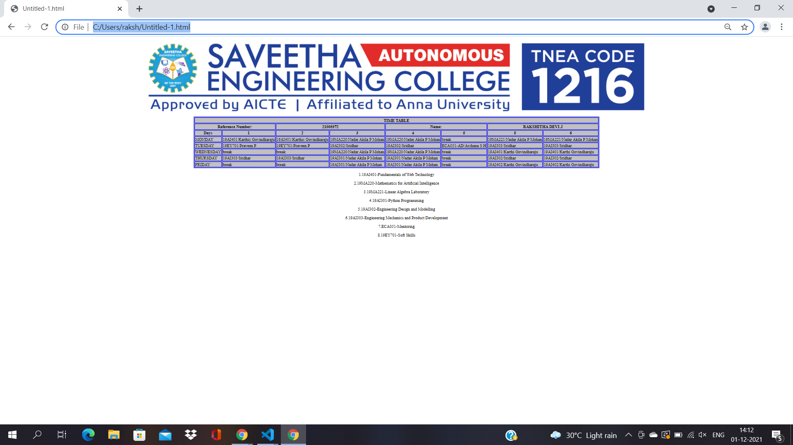

# Experiment_Time_Table

## AIM
To Write a html webpage page to display your timetable.

# ALGORITHM
### STEP 1
create a simple table using table tag
### STEP 2
Add header row using th tag
### STEP 3
Add your timetable
### STEP 4
Execute the program

# CODE
~~~<!DOCTYPE html>
<html>
<body>

</body>

      <table border="2" cellspacing="2" bordercolor="blue" bgcolor="silver" align="center">
         <tbody><tr>
            <th colspan="8">TIME TABLE</th>
         </tr>

<tr><th colspan="2">Reference Number:</th>
<th colspan="2">21005572</th>
<th colspan="2">Name:</th>
<th colspan="2">RAKSHITHA DEVI.J</th>
</tr>
    

    
  
         
         <tr>
            <th>Days</th>
            <th>1</th>
            <th>2</th>
            <th>3</th>
             <th>4</th>
            <th>5</th>
            <th>5</th>
            <th>6</th>
         </tr>
          <tr>
             <td>MONDAY</td>
             <td>19AI401/Karthic Govindharaju</td>
             <td>19AI401/Karthic Govindharaju</td>
             <td>19MA220/Nadar Akila P Mohan</td>
             <td>19MA220/Nadar Akila P Mohan</td>
             <td>break</td>
             <td>19MA221/Nadar Akila P Mohan</td>
             <td>19MA221/Nadar Akila P Mohan</td>
         </tr>
          <tr>
             <td>TUESDAY</td>
             <td>19EY701/Praveen P</td>
             <td>19EY701/Praveen P</td>
             <td>19AI302/Sridhar</td>
             <td>19AI302/Sridhar</td>
             <td>ECA051-AD/Archana S H</td>
             <td>19AI303/Sridhar</td>
             <td>19AI303/Sridhar</td>
         </tr>
         <tr>
             <td>WEDNESDAY</td>
             <td>break</td>
             <td>break</td>
             <td>19MA220/Nadar Akila P Mohan</td>
             <td>19MA220/Nadar Akila P Mohan</td>
             <td>break</td>
             <td>19AI401/Karthi Govindharaju</td>
             <td>19AI401/Karthi Govindharaju</td>
         </tr>
  
         <tr>
             <td>THURSDAY</td>
             <td>19AI303/Sridhar</td>
             <td>19AI303/Sridhar</td>
             <td>19AI301/Nadar Akila P Mohan</td>
             <td>19AI301/Nadar Akila P Mohan</td>
             <td>break</td>
             <td>19AI302/Sridhar</td>
             <td>19AI302/Sridhar</td>
         </tr>
         <tr>
             <td>FRIDAY</td>
             <td>break</td>
             <td>break</td>
             <td>19AI301/Nadar Akila P Mohan</td>
             <td>19AI301/Nadar Akila P Mohan</td>
             <td>break</td>
             <td>19AI402/Karthi Govindharaju</td>
             <td>19AI402/Karthi Govindharaju</td>
         </tr>
    

         </tbody></table>
      
                

1.19AI401-Fundamentals of Web Technology

2.19MA220-Mathematics for Artificial Intelligence

3.19MA221-Linear Algebra Laboratory

4.19AI301-Python Programming

5.19AI302-Engineering Design and Modelling

6.19AI303-Engineering Mechanics and Product Development

7.ECA051-Mentoring

8.19EY701-Soft Skills

  </body></html>

~~~
# OUPUT

RESULT:
The timetable has been created and tested successfully

